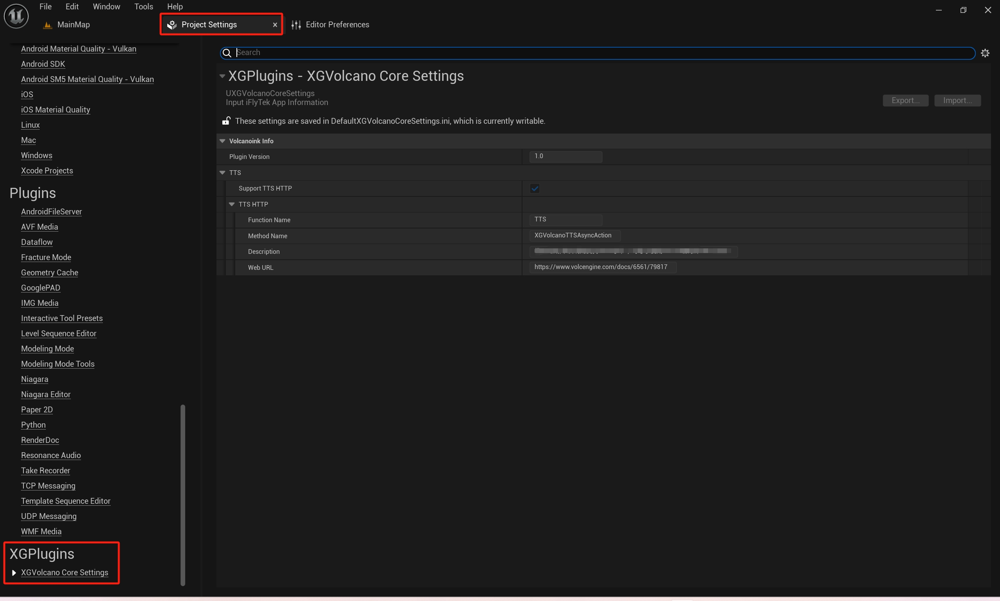
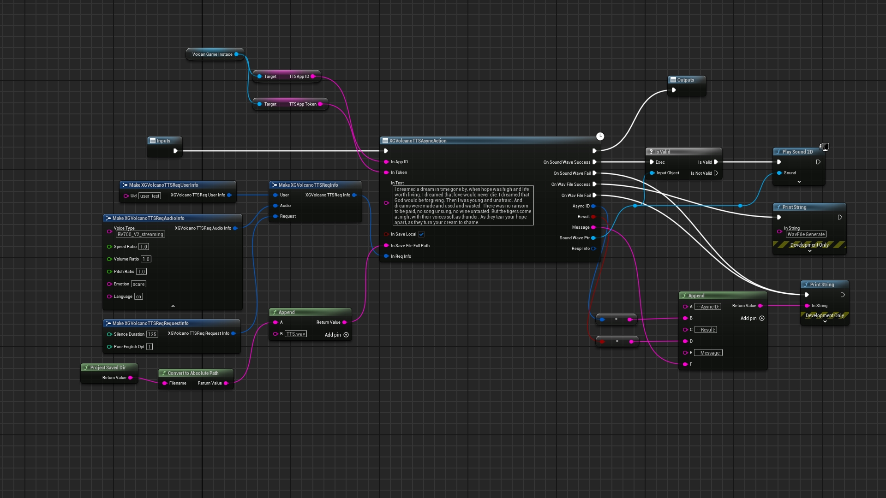

# XGVolcanoLink  
Plugin Version:1.0
## Brief  

&emsp;&emsp;This is XGVolcanoLink project,which it helps to connect VolcEngine with UnrealEngine 5.</br>
&emsp;&emsp;At pressent,It contains some functions :</br>
&emsp;&emsp;Text To Speech</br>
&emsp;&emsp;TODO more...</br>
&emsp;&emsp;It contains two parts:</br>
&emsp;&emsp;"Picture":There are some pictures used by this document.</br>
&emsp;&emsp;"XGVolcanoLinkDemo":The project shows you how to quickly use this plugin.Before you start it,you should purchase the plugin and install it to UnealEngine 5.Then,you should prepare some necessary resources(text,auido,img...).You must register your App info from VolcEngine Web by yourself.</br>
&emsp;&emsp;UE Marketplace URL:</br>
&emsp;&emsp;[XGVolcanoLink-TODO]()</br>
&emsp;&emsp;Chinese Instruction URL:</br>
&emsp;&emsp;[中文说明书-TODO]()</br>
&emsp;&emsp;VolcEngine Web URL:</br>
&emsp;&emsp;[VolcEngine](https://www.volcengine.com/)</br>
## Get App Information</br>
&emsp;&emsp;If you don't create the VolcEngine App,you should create it.</br>
&emsp;&emsp;After you create the App, you should enable corresponding function in your VolcEngine control panel,such as TTS.</br>
&emsp;&emsp;You have to get some App informat,such as AppID,Token.....</br>
&emsp;&emsp;Be careful that some functions are not free.Howover,You can try it for free in a short time.</br>
## Browse The Plugin From UE
&emsp;&emsp;You can quickly learn which method and documentation each API corresponds to.</br>
<br>
  
<br>  

## Functional Detail
### TTS  
&emsp;&emsp;URL:https://www.volcengine.com/docs/6561/79820<br>
&emsp;&emsp;You can choose different speakers, different emotional styles, different languages by entering different parameters.<br>
&emsp;&emsp;For the parameter list, refer to the official website.<br>
&emsp;&emsp;You can keep the default for test.<br><br>
  

## XGVolcanoLinkDemo

&emsp;&emsp;1.App info shoulud be input "Content/GameFrame/BP_XGVolcanGameInstace"<br><br>
&emsp;&emsp;2.All BP methods are in "Content/GameFrame/BP_ShowCode"<br><br>
&emsp;&emsp;3.All buttons are in "Content/UI/WBP_MainUI"<br><br>
&emsp;&emsp;4.Some nodes need to temporarily prepare pictures, audio and other resources in the Saved directory of the project for testing, and specify the file location in the blueprint node. If the test is packaged, you also need to copy the same resource in the packaged path;<br><br>
&emsp;&emsp;5.More methods will be added;<br><br>
## Framwork  
&emsp;&emsp;XGVolcanoCoreModule:<br> 
&emsp;&emsp;Common API exposed to other module<br><br> 
&emsp;&emsp;XGVolcanoTTSModule:<br>
&emsp;&emsp;TTS Module<br><br> 
&emsp;&emsp;XGVolcanoLinkModule:<br>
&emsp;&emsp;It contains UE C++ API<br><br> 
&emsp;&emsp;XGVolcanoOtherModule:<br>
&emsp;&emsp;......(to be added)<br><br>
&emsp;&emsp;C++API:<br>
&emsp;&emsp;......\Plugins\XGVolcanoLink\Source\XGVolcanoLink\Public\XGVolcanoLinkBPLibrary.h<br>
&emsp;&emsp;Other API is highly customized.<br>
&emsp;&emsp;It may be not good for the general design.<br>
&emsp;&emsp;Remember it:<br>
&emsp;&emsp;If you use C++ API,you should add the modules to your "*.build.cs".<br>
```
public class XGVolcanoDemo : ModuleRules
{
	public XGVolcanoDemo(ReadOnlyTargetRules Target) : base(Target)
	{
		PCHUsage = PCHUsageMode.UseExplicitOrSharedPCHs;
	
		PublicDependencyModuleNames.AddRange(new string[] { 
			"Core", 
			"CoreUObject", 
			"Engine", 
			"InputCore","
			 XGVolcanoLink",
			"XGVolcanoCore",
			"XGVolcanoTTS",
			"XGVolcanoOther......"
        });

		PrivateDependencyModuleNames.AddRange(new string[] {  });


	}
}

```

## Package
&emsp;&emsp;Windows:[5.0-5.3].<br>
&emsp;&emsp;Andriod:Only version 5.3 has been tested.<br>
## Other
&emsp;&emsp;This plugin does not contain any VolcEngine's files(\*.h,\*.cpp,\*.lib,......)

&emsp;&emsp;This plugin does not contain AI code or AI Model code.

&emsp;&emsp;This plugin will not send any data to the plugin author.

&emsp;&emsp;his plugin was not developed by VolcEngine.

&emsp;&emsp;This plugin will only send the interactive data to VolcEngine and recieve the message from VolcEngine . This plugin will not generate any data directly.You must comply with the relevant user and data usage agreements about VolcEngine.These agreements can be found in the VolcEngine website.  

&emsp;&emsp;If the plugin is useful for you. Please purchase it in Unreal Engine Marketplace.

&emsp;&emsp;Thanks a lot.

## Contact Information    

&emsp;&emsp;Please contact me if you have any questions about [XGVolcanoLink-todo]().<br>

&emsp;&emsp;QQ:<br>
&emsp;&emsp;709777172<br>

&emsp;&emsp;Email:<br>
&emsp;&emsp;709777172@qq.com<br>

&emsp;&emsp;bilibili:<br>
&emsp;&emsp;[虚幻小刚](https://space.bilibili.com/8383085)<br>


