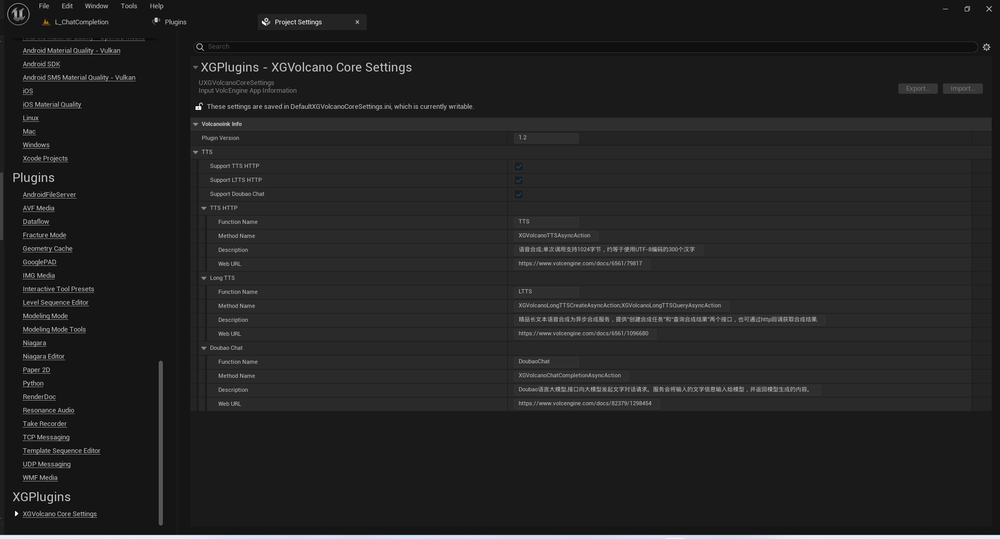

# XGVolcanoLink  
插件版本:1.2</br>
- [XGVolcanoLink](#xgvolcanolink)
	- [简介](#简介)
	- [获取应用信息](#获取应用信息)
	- [浏览UE插件信息](#浏览ue插件信息)
	- [函数细节](#函数细节)
		- [TTS](#tts)
		- [Long TTS](#long-tts)
		- [Chat](#chat)
	- [XGVolcanoLinkDemo示例工程](#xgvolcanolinkdemo示例工程)
	- [框架](#框架)
	- [打包](#打包)
	- [其他](#其他)
	- [联系方式](#联系方式)


## 简介  
&emsp;&emsp;这是XGVolcanoLink项目，它有助于连接火山引擎(VolcEngine)与UnrealEngine 5。</br>
&emsp;&emsp;目前，它包含一些功能：</br>
&emsp;&emsp;支持在线语音合成</br>
&emsp;&emsp;精品长文本语音合成(创建和查询)</br>
&emsp;&emsp;豆包模型ChatCompletion</br>
&emsp;&emsp;这个代码库中包含以下部分:</br>
&emsp;&emsp;"Picture":有一些图片是这个文档使用的。</br>
&emsp;&emsp;"XGVolcanoLinkDemo":该项目向您展示了如何快速使用此插件。在开始之前，您应该购买插件并将其安装到UnealEngine 5。然后，你应该准备一些必要的资源（文本、音频、视频……）。您必须自己从VolcEngine Web注册您的应用程序信息。</br>
&emsp;&emsp;FAB URL:</br>
&emsp;&emsp;[XGVolcanoLink](https://www.fab.com/zh-cn/listings/eac3657b-62b6-422b-84f0-7e3c08504d94)</br>
&emsp;&emsp;English Instruction URL:</br>
&emsp;&emsp;[README](./README.md)</br>
&emsp;&emsp;Chinese Instruction URL:</br>
&emsp;&emsp;[中文说明书-TODO]()</br>
&emsp;&emsp;VolcEngine Web URL:</br>
&emsp;&emsp;[VolcEngine](https://www.volcengine.com/)</br>
## 获取应用信息</br>
&emsp;&emsp;如果你没有创建VolcEngine应用程序，你应该创建它</br>
&emsp;&emsp;App创建完成后，您应该在您的VolcEngine控制面板中启用相应的功能，例如TTS.</br>
&emsp;&emsp;您必须获得一些应用程序信息，例如AppID，令牌.....</br>
&emsp;&emsp;注意有些函数不是免费的.但是，您可以在短时间内免费试用.
## 浏览UE插件信息
&emsp;&emsp;您可以快速了解每个API对应的方法和文档。</br>
<br>
  
<br>  

## 函数细节
### TTS  
&emsp;&emsp;URL:https://www.volcengine.com/docs/6561/79820<br>
&emsp;&emsp;你可以通过输入不同的参数来选择不同的演讲者，不同的情感风格，不同的语言。<br>
&emsp;&emsp;参数列表请参见官方网站。<br>
&emsp;&emsp;您可以为测试保留默认值。<br>
&emsp;&emsp;如果UE>=5.4,请使用TTS的PCM接口<br>
  

### Long TTS
&emsp;&emsp;URL:https://www.volcengine.com/docs/6561/1096680<br>
&emsp;&emsp;精品长文本语音合成为异步合成服务，提供“创建合成任务”和“查询合成结果”两个接口.<br>
&emsp;&emsp;参数列表请参见官方网站。<br>
&emsp;&emsp;您可以为测试保留默认值。<br>
  

### Chat
&emsp;&emsp;URL:https://www.volcengine.com/docs/82379/1298454<br>
&emsp;&emsp;Doubao语言大模型,接口向大模型发起文字对话请求。服务会将输入的文字信息输入给模型，并返回模型生成的内容.<br>
&emsp;&emsp;参数列表请参见官方网站。<br>
&emsp;&emsp;您可以为测试保留默认值。但是您必须输入自己的API密钥信息及接入点<br>
  


## XGVolcanoLinkDemo示例工程

&emsp;&emsp;1.应用信息应该输入“Content/GameFrame/BP_XGVolcanGameInstace”<br><br>
&emsp;&emsp;2.所有BP方法都应列举在“Content/GameFrame/BP_ShowCode”中<br><br>
&emsp;&emsp;3.所有按钮位于类似“Content/UI/WBP_MainUI”<br><br>
&emsp;&emsp;4.部分节点需要在项目的“Saved”目录下临时准备图片、音频等资源进行测试，并在蓝图节点中指定文件位置。如果测试是打包的，您还需要在打包路径中复制相同的资源；<br><br>
&emsp;&emsp;5.将添加更多的方法；<br><br>
## 框架  
&emsp;&emsp;XGVolcanoCoreModule:<br> 
&emsp;&emsp;内部使用的通用API<br><br> 
&emsp;&emsp;XGVolcanoTTSModule:<br>
&emsp;&emsp;语音合成模块<br><br> 
&emsp;&emsp;XGVolcanoLinkModule:<br>
&emsp;&emsp;包含了暴露给外部使用的C++接口<br><br> 
&emsp;&emsp;XGVolcanoChatModule:<br>
&emsp;&emsp;大模型对话模块<br><br> 
&emsp;&emsp;XGVolcanoOtherModule:<br>
&emsp;&emsp;......(未来可能添加的其他模块)<br><br>
&emsp;&emsp;C++API:<br>
&emsp;&emsp;......\Plugins\XGVolcanoLink\Source\XGVolcanoLink\Public\XGVolcanoLinkBPLibrary.h<br>
&emsp;&emsp;其他API是高度定制的。<br>
&emsp;&emsp;内部定制的API如果在外部使用,可能不太方便<br>
&emsp;&emsp;注意:<br>
&emsp;&emsp;如果你需要直接使用C++ API,你应当添加对应的模块到你所需要使用的模块中("*.build.cs").参考如下:<br>
```
public class XGVolcanoDemo : ModuleRules
{
	public XGVolcanoDemo(ReadOnlyTargetRules Target) : base(Target)
	{
		PCHUsage = PCHUsageMode.UseExplicitOrSharedPCHs;
	
		PublicDependencyModuleNames.AddRange(new string[] { 
			"Core", 
			"CoreUObject", 
			"Engine", 
			"InputCore","
			 XGVolcanoLink",
			"XGVolcanoCore",
			"XGVolcanoTTS",
			"XGVolcanoOther......"
        });

		PrivateDependencyModuleNames.AddRange(new string[] {  });


	}
}

```

## 打包
&emsp;&emsp;Windows & Andriod:[5.3-5.5].<br>
## 其他
&emsp;&emsp;该插件不包含火山引擎的任何文件(\*.h,\*.cpp,\*.lib,......)<br>

&emsp;&emsp;该插件不包含AI生成的任何内容或相关代码.<br>

&emsp;&emsp;该插件不会发送任何数据给插件作者.<br>

&emsp;&emsp;该插件并不是火山引擎官方人员开发.<br>

&emsp;&emsp;这个插件只会将交互数据发送到VolcEngine，并从VolcEngine接收消息。这个插件不会直接生成任何数据。您必须遵守有关VolcEngine的用户协议和数据使用协议。这些协议可以在VolcEngine网站上找到。<br>

&emsp;&emsp;如果插件对你有用。请在Fab商城市场购买正版。<br>

&emsp;&emsp;非常感谢.<br>

## 联系方式  

&emsp;&emsp;关于插件[XGVolcanoLink](https://www.fab.com/zh-cn/listings/eac3657b-62b6-422b-84f0-7e3c08504d94)相关问题请联系我.<br>

&emsp;&emsp;QQ:<br>
&emsp;&emsp;709777172<br>

&emsp;&emsp;Email:<br>
&emsp;&emsp;709777172@qq.com<br>

&emsp;&emsp;bilibili:<br>
&emsp;&emsp;[虚幻小刚](https://space.bilibili.com/8383085)<br>


